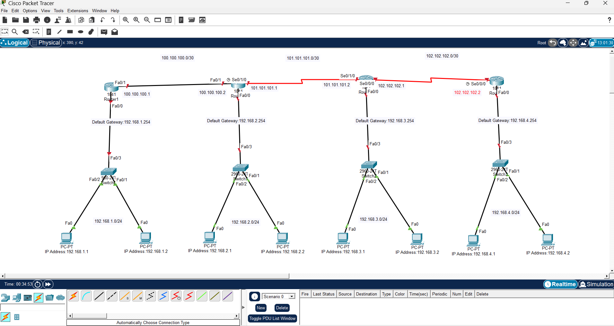

# Multi-Subnet Static Routing Network Architecture

A 4-tier network topology built and simulated inside **Cisco Packet Tracer**, demonstrating manual enterprise static routing path selection, IP subnet allocation, and localized Gateway assignment across isolated broadcast domains.

## 🌐 Topology Map


## 🛠️ Design Parameters

### Local Area Networks (LAN)
* **LAN 1:** 192.168.1.0/24 (Gateway: 192.168.1.254)
* **LAN 2:** 192.168.2.0/24 (Gateway: 192.168.2.254)
* **LAN 3:** 192.168.3.0/24 (Gateway: 192.168.3.254)
* **LAN 4:** 192.168.4.0/24 (Gateway: 192.168.4.254)

### Inter-Router Transport Subnets (WAN)
* **Router 1 ↔ Router 2:** 100.100.100.0/30 (FastEthernet Cross-over Link)
* **Router 2 ↔ Router 3:** 101.101.101.0/30 (Serial Point-to-Point Link)
* **Router 3 ↔ Router 4:** 102.102.102.0/30 (Serial Point-to-Point Link)

## 💻 Sample Routing Matrix (Router 2 Example)
```text
ip route 192.168.1.0 255.255.255.0 100.100.100.1
ip route 192.168.3.0 255.255.255.0 101.101.101.2
ip route 192.168.4.0 255.255.255.0 101.101.101.2
ip route 102.102.102.0 255.255.255.252 101.101.101.2
```

## 🚀 How to Run the Lab
1. Clone this repository to your local system.
2. Ensure you have **Cisco Packet Tracer** installed.
3. Open the `static-routing-lab.pkt` file.
4. Execute endpoint testing via PING or the Packet Tracer ICMP Simulation panel.
5.